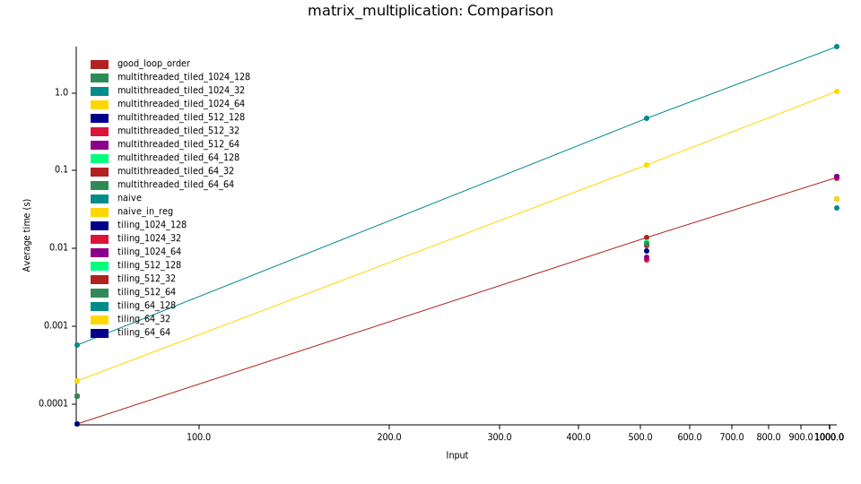

# Benchmark Results: Matrix Multiplication 🚀

This report presents benchmark results for matrix multiplication using Criterion.rs.
## Benchmark System  
The benchmark was run on:  
- 💻 **MacBook M2 Pro**  
- 🧠 **8GB RAM**  
- ⚙️ **macOS 15.2 (Build 24C101)**  
- 🛠️ **Rust Version: 1.84.1 (e71f9a9a9 2025-01-27)**  

## Performance Graph

## Histogram

Generated using [Criterion.rs](https://bheisler.github.io/criterion.rs/book/).
